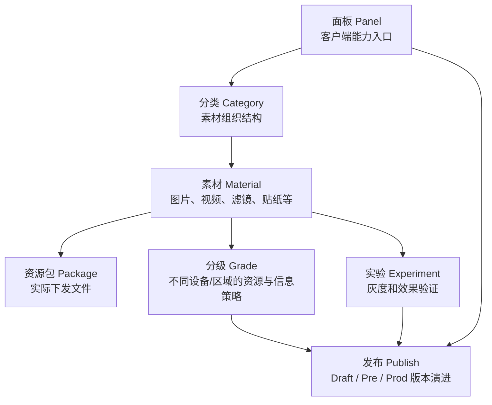
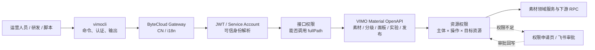
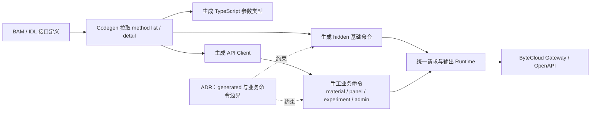
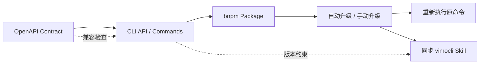
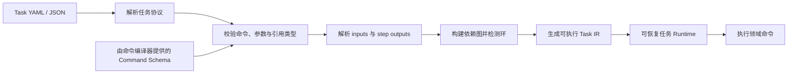
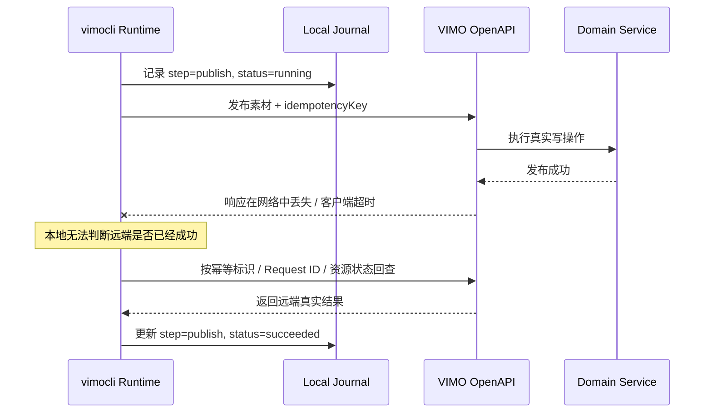
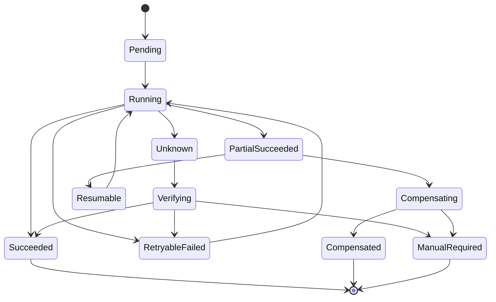

# VIMO 素材 OpenAPI / CLI 平台化：简历与面试总稿

> 更新时间：2026-07-23
>
> 文档用途：同时维护可直接进入简历的终极版、严格对应现有实现的老实版、逐条技术解释、真实代码证据和后续面试脑图。
>
> 核心原则：业务决定项目边界，理想架构决定技术上限，真实代码负责提供术语、约束和答辩支点。

## 0. 阅读说明

本文档有两套简历版本：

| 版本 | 用途 | 表达边界 |
|---|---|---|
| 终极版 | 最终求职简历、技术面试主叙事 | 按完整系统形态表达，包含基于真实业务推演出的声明式任务和可靠 Runtime |
| 老实版 | 事实审计、保守投递、答辩兜底 | 只使用当前代码、测试、发布记录和已确认指标可以直接支撑的内容 |

正文使用以下标签区分证据等级：

| 标签 | 含义 |
|---|---|
| `真实落地` | 当前代码或发布记录中已经存在 |
| `真实指标` | 用户已经确认口径的结果数字 |
| `架构包装` | 基于真实实现升维后的系统描述 |
| `设计推演` | 技术上可行、用于终极版和面试设计，但当前仓库尚无完整实现 |
| `待确认` | Ownership、数字口径或实现范围仍需继续核对 |

推荐阅读顺序：

```text
快速取用简历：第 1 章终极版 / 第 4 章老实版
理解项目业务：第 2 章
准备技术面试：第 3 章
核对事实证据：第 5、7 章
制作脑图模拟：第 8 章
```

---

## 1. 终极版简历

### 1.1 项目名称

`VIMO 素材 OpenAPI / CLI 平台化`

### 1.2 项目简介

面向 VIMO 素材能力依赖 Web 后台、跨场景复用和自动化接入成本高的问题，建设“业务能力 → OpenAPI → Gateway / 身份与资源权限 → `vimocli`”开放链路，将素材、分级、面板、实验和发布等运营动作沉淀为可编排、可治理、可恢复的标准能力。

### 1.3 核心贡献

1. 构建契约驱动的领域命令编译器，由 BAM / IDL 自动生成类型化客户端与基础命令，在其上封装业务语义命令；结合自更新、版本兼容和 Skill 同步，实现 OpenAPI、CLI 与使用契约的一致演进。
2. 设计声明式运营任务协议，将素材上新、分级和实验发布等跨资源流程沉淀为可版本化任务描述，通过类型校验、资源引用与依赖编译，使复杂运营流程可复用、可评审、可回放。
3. 构建可恢复任务 Runtime，以本地执行日志持久化步骤状态与远端结果，并通过幂等、结果回查和失败补偿处理响应丢失与部分成功，支持进程中断后的断点续跑及结果收敛。

### 1.4 项目收益

Q2 覆盖国内外用户 70+，相对 30 人目标达成率 233%+；沉淀 40+ OpenAPI，累计调用 9 万+，覆盖素材、分级、面板、实验、发布等 5 类核心运营场景。

### 1.5 一句话能力画像

这段经历希望让面试官形成的最终判断是：能够把依附页面的业务能力重构为稳定开放契约，并继续向领域命令编译、声明式流程和可靠执行 Runtime 演进。

---

## 2. 业务背景与整体链路

### 2.1 VIMO 素材平台在管理什么

VIMO 是面向视频编辑器素材生产与分发的内部管理平台。素材并不是一个孤立文件，而是处在一套完整的运营关系中：



一次完整运营操作可能包含创建素材、补充资源包、配置分级、加入面板分类、创建实验、发布素材或面板等多个步骤。原始能力主要服务 Web 管理后台，依赖页面登录态、页面参数和人工操作顺序。

### 2.2 为什么要建设 OpenAPI 和 CLI

直接复用页面接口存在四个问题：

| 问题 | 具体表现 | 需要补齐的系统能力 |
|---|---|---|
| 能力依附页面 | 调用方需要理解页面请求、Cookie 和内部参数 | 稳定的 OpenAPI 契约 |
| 身份边界变化 | 脚本没有 Web 登录态，还存在个人与服务账号两类身份 | Gateway JWT、Service Account、业务线和站点上下文 |
| 权限粒度不同 | 能访问接口不等于能发布某类素材或某个面板 | 接口权限与资源权限分层治理 |
| 调用方式分散 | 每个团队重复写脚本、处理错误和版本升级 | 标准 CLI、结构化输出和客户端版本治理 |

OpenAPI 和 CLI 分别处在不同层次：

```text
OpenAPI：定义“平台允许外部调用什么能力”
vimocli：定义“用户和脚本如何稳定、安全地执行这些能力”
```

### 2.3 当前真实开放链路



这条链路中，Gateway 和 JWT 解决身份可信问题，接口权限解决“能否进入某个 OpenAPI”，资源权限继续判断“能否对某个面板、素材类型执行新增、修改或发布”。`vimocli` 位于消费入口，负责把站点、业务线、认证、参数和输出差异收敛起来。

### 2.4 典型业务 Case：素材完整上新

一条可以贯穿终极版三个技术故事的业务流程是：

```text
创建素材
  → 配置资源包或素材信息分级
  → 加入指定面板分类
  → 创建或关联实验
  → 发布素材
  → 发布相关面板
```

当前每个动作已经能够由不同 OpenAPI 或 CLI 命令承接，但跨步骤的参数传递、流程复用和故障恢复仍需要人工脚本处理。终极版的声明式任务与可靠 Runtime，就是围绕这类真实业务链路继续推演。

### 2.5 100 分架构参考：借鉴机制，不照搬产品

终极版的设计不是把几个流行名词拼在一起，而是从相邻成熟系统中抽取与 VIMO 业务冲突直接相关的机制。下面的参考只用于面试中的设计依据，不能理解为 VIMO 已经完整复刻这些系统。

| 参考系统 | 借鉴的成熟机制 | 可迁移到 VIMO 的设计 | 不能直接照搬的边界 |
|---|---|---|---|
| Terraform | 声明式配置、执行前计划、状态与实际资源对照 | 让素材上新流程先编译成任务 IR，执行前检查资源引用和当前状态，减少人工串行脚本 | VIMO 的 OpenAPI 并非都支持完整的 plan / diff 语义，不能假设所有写操作都能安全预览 |
| Temporal | 事件历史、持久化执行、重试与恢复 | 用本地 Journal 记录步骤状态、请求标识和远端结果，将“超时后是否已成功”纳入 Runtime 状态机 | Temporal 依赖服务端持久化和调度集群，`vimocli` 先解决本地进程中断与远端结果不确定，不能虚构成分布式工作流平台 |
| `kubectl` / API machinery | 生成客户端覆盖 API，人工命令保持领域语义，Context 统一环境入口 | 以 BAM / IDL 生成 hidden 基础命令，以手工业务命令承接素材语义，并统一站点、业务线和认证上下文 | VIMO 的权限对象是业务资源和审批关系，不等同于 Kubernetes 通用 RBAC；命令设计也不能退化成资源 CRUD 映射 |

由此可以得到三条适合 VIMO 的设计判断：

1. **编译器解决扩展问题。** OpenAPI 增长时，生成层负责覆盖率，业务层负责语义和兼容；两层不能混成一套命令。
2. **任务协议解决流程问题。** 只有当多个原子命令之间存在资源引用、依赖和复用需求时，才值得引入任务描述；它的价值是可校验和可版本化，不是换一种格式写 Shell。
3. **Runtime 解决不确定性问题。** 远程写操作无法天然原子回滚，系统必须显式表达 `unknown`、回查、补偿和人工接管，而不是把所有异常都归为失败重试。

---

## 3. 终极版逐条拆解

### 3.1 项目简介为什么这样写

终极版简介同时承担三个任务：

1. 交代业务问题：核心能力依赖 Web 后台，难以被其他入口复用。
2. 交代整体架构：业务能力经过 OpenAPI、Gateway 和权限治理，再由 CLI 消费。
3. 交代技术演进：项目不止是“接口可访问”，还要向可编排和可恢复执行发展。

简介中不单独展开 BAM、JWT、Service Account、CN/i18n 和审批。这些属于开放链路的必要组成，但不值得分别占据简历核心贡献。

---

### 3.2 贡献一：领域命令编译器与客户端生命周期

#### 简历原句

> 构建契约驱动的领域命令编译器，由 BAM / IDL 自动生成类型化客户端与基础命令，在其上封装业务语义命令；结合自更新、版本兼容和 Skill 同步，实现 OpenAPI、CLI 与使用契约的一致演进。

#### 业务场景

素材开放能力覆盖素材、分级、面板、分类、实验、发布和运维等多个领域。OpenAPI 数量增长后，如果每个接口都手写请求函数、参数解析和命令入口，接口规模会直接转化为重复开发和维护成本；如果将 API 方法名直接暴露给用户，又会让 CLI 退化为后端接口的机械映射。

这里存在两个冲突：

```text
接口覆盖率 vs 用户可理解的业务语义
自动生成效率 vs 已有命令的兼容稳定性
```

#### 当前真实设计

`vimocli` 已采用 hidden generated commands 与手工业务命令的双层架构：



真实实现中：

- Codegen 从 BAM 获取接口列表和详情，并缓存接口定义。
- 请求 Schema 被转换为 TypeScript 类型、API 函数和 hidden 命令。
- `_generated.ts` 只负责机械覆盖，用户帮助中不展示。
- `material.ts`、`panel.ts`、`experiment.ts`、`admin.ts` 手工维护业务入口。
- 两层命令最终调用同一批 generated API functions。

#### 一个具体例子：素材发布

底层 OpenAPI 是 `BatchPublishMaterials`，生成层保留 hidden 命令 `batch-publish-materials`。业务命令对用户暴露为更稳定的：

```bash
vimocli material publish --rids rid1,rid2
```

业务命令负责把用户的 `--rids` 转换为 OpenAPI 的 `item_id`，并自动补齐当前业务线。这样，底层接口命名和参数结构可以继续演进，而用户的业务入口保持稳定。

#### 为什么这不只是普通 Codegen

真正需要处理的工程问题包括：

| 问题 | 当前处理方式 | 终极演进方向 |
|---|---|---|
| BAM ref 类型不完整 | 对已知 ref 维护明确类型映射 | 建立更完整的 Contract IR 与类型校验 |
| 64 位素材 ID 精度 | 对普通数字与 RID 分别处理，RID 保持字符串 | 在 Schema 层标记业务 ID 类型 |
| Commander 参数名转换 | 维护参数 alias，例如 `previewDIDs` | 由契约生成稳定的参数映射表 |
| 接口与业务语义不一致 | generated hidden + 手工业务命令 | 建立业务命令适配层和兼容测试 |
| CLI 与 Skill 漂移 | CLI 自更新后尽力同步 Skill | 增加兼容矩阵、变更检测与迁移提示 |

#### 客户端生命周期

客户端侧已经具备手动更新、自动升级、包管理器识别、升级后重新执行当前命令以及 Skill 同步。终极版将这些能力进一步归纳为“客户端生命周期治理”：



#### 终极设计需要新增的代码

| 模块 | 主要职责 | 状态 |
|---|---|---|
| `src/tools/codegen.ts` | BAM 定义到 API 和 hidden 命令的生成 | `真实落地` |
| `src/cli/commands/**` | 面向业务意图的稳定命令 | `真实落地` |
| `src/self/**` | 自动升级、重新执行与 Skill 同步 | `真实落地` |
| `src/contracts/diff.ts` | 比较新旧契约，识别 breaking changes | `设计推演` |
| `src/contracts/compatibility.ts` | 维护 CLI、契约和 Skill 的兼容关系 | `设计推演` |
| `src/contracts/migration.ts` | 为废弃参数和命令生成迁移提示 | `设计推演` |

#### 面试钩子

主问题：

> 如何覆盖 40+ OpenAPI，又不让 CLI 变成 40 组后端参数的机械搬运？

三级追问：

1. 为什么不全部生成用户可见命令？
2. 生成命令和手工业务命令的参数发生漂移时如何发现？
3. 删除或修改接口字段时，如何保证旧脚本继续运行？

#### 事实边界

`真实落地`：BAM Codegen、类型化 API、hidden 命令、业务命令、自更新和 Skill 同步。

`设计推演`：完整 Contract IR、Breaking Change 自动检测、兼容矩阵和迁移引擎。

---

### 3.3 贡献二：声明式运营任务协议

#### 简历原句

> 设计声明式运营任务协议，将素材上新、分级和实验发布等跨资源流程沉淀为可版本化任务描述，通过类型校验、资源引用与依赖编译，使复杂运营流程可复用、可评审、可回放。

#### 它想解决什么问题

当前 CLI 已经提供大量原子命令，但复杂运营流程仍然通常通过人工串行执行或临时 Shell 脚本完成。例如素材完整上新需要连续创建素材、配置分级、加入面板、创建实验和发布。

Shell 脚本的主要问题不是语法不好看，而是缺少领域约束：

- 上一步返回的 RID 需要人工解析和传递。
- 命令参数只有运行到对应步骤时才能发现错误。
- 步骤之间的依赖关系隐含在脚本顺序中。
- 脚本无法判断 CLI 升级后某个参数是否已经变化。
- 流程失败后没有统一任务状态，恢复逻辑由每个脚本自行实现。

声明式运营任务希望把这些隐含信息转换为显式协议。

#### 示例：素材上新任务

```yaml
version: v1
name: material-launch

inputs:
  file: string
  panel_id: string
  grade_rule: string
  experiment_name: string

steps:
  create:
    run: material.create
    with:
      file: ${inputs.file}

  grade:
    run: material.grade.create
    needs: [create]
    with:
      material_rid: ${steps.create.output.rid}
      rule: ${inputs.grade_rule}

  add_panel:
    run: material.panel.add
    needs: [create]
    with:
      material_rid: ${steps.create.output.rid}
      panel_id: ${inputs.panel_id}

  experiment:
    run: material.experiment.create
    needs: [grade, add_panel]
    with:
      material_rid: ${steps.create.output.rid}
      name: ${inputs.experiment_name}

  publish:
    run: material.publish
    needs: [experiment]
    with:
      rids: [${steps.create.output.rid}]
```

#### 编译与执行链路



这里的关键不是 YAML，而是 Task 文件能够在执行前完成静态检查，并被编译成 Runtime 能理解的稳定中间结构。

#### 核心数据模型草图

```ts
interface TaskDefinition {
  version: string;
  name: string;
  inputs: Record<string, InputSchema>;
  steps: Record<string, TaskStepDefinition>;
}

interface TaskStepDefinition {
  run: string;
  needs?: string[];
  with: Record<string, unknown>;
}

interface CompiledTaskStep {
  id: string;
  command: string;
  dependencies: string[];
  resolvedInputSchema: Record<string, unknown>;
  outputSchema: Record<string, unknown>;
}
```

#### 需要实现的代码模块

| 模块 | 职责 |
|---|---|
| `src/task/schema.ts` | 定义任务文件格式和版本 |
| `src/task/parser.ts` | 解析 YAML / JSON 并输出 AST |
| `src/task/type-checker.ts` | 基于命令 Schema 校验参数和步骤输出引用 |
| `src/task/reference-resolver.ts` | 解析 `${inputs.*}` 和 `${steps.*.output.*}` |
| `src/task/dependency-graph.ts` | 构建 DAG、检测循环依赖和缺失步骤 |
| `src/task/compiler.ts` | 将任务定义编译为 Runtime 可执行结构 |
| `src/task/template-registry.ts` | 管理任务模板版本与兼容迁移 |

以上模块均为 `设计推演`，当前仓库尚无对应实现。

#### 难点在哪里

1. **命令 Schema 必须稳定。** 任务协议不能依赖 Commander 的临时参数解析，而需要从命令编译器获得可版本化的输入输出类型。
2. **步骤输出引用需要类型检查。** `create.output.rid` 必须能够被后续 `material_rid` 接受，不能等到真实执行后才发现字段不存在。
3. **命令升级不能破坏历史任务。** 任务文件记录协议版本，Runtime 需要决定迁移、兼容还是拒绝执行。
4. **业务流程不总是线性。** 分级和面板关联可以并行，实验和发布需要等待依赖完成，因此必须显式编译依赖图。
5. **复用不能牺牲业务可读性。** 任务模板应该表达素材上新流程，而不是重新暴露一组底层 HTTP 请求。

#### 面试钩子

主问题：

> 为什么复杂运营流程只能写成不可校验的 Shell 脚本，不能像代码一样被类型检查、评审和版本管理？

三级追问：

1. Task DSL 与直接写 TypeScript 脚本相比有什么价值？
2. 上一步输出如何安全地传递给后续步骤？
3. CLI 参数升级后，历史任务模板如何迁移？

#### 事实边界

`真实支点`：素材、分级、面板、实验和发布均已有独立 OpenAPI 或 CLI 原子命令；双层命令架构能够提供任务编译所需的能力目录。

`设计推演`：任务 DSL、依赖编译、模板注册和静态类型检查尚未在当前 `vimocli` 仓库落地。

---

### 3.4 贡献三：可恢复任务 Runtime

#### 简历原句

> 构建可恢复任务 Runtime，以本地执行日志持久化步骤状态与远端结果，并通过幂等、结果回查和失败补偿处理响应丢失与部分成功，支持进程中断后的断点续跑及结果收敛。

#### 最核心的故障场景

可恢复 Runtime 处理的不是普通“接口报错重试”，而是远程写操作结果不确定的问题：



如果此时直接重试，可能重复创建、重复发布或覆盖错误版本；如果直接记录失败，本地任务状态又会与远端真实状态不一致。

#### 任务状态模型



这里需要明确区分：

- `failed`：能够确定远端没有完成。
- `unknown`：请求结果不明确，需要回查。
- `partial_succeeded`：多个步骤中只有部分成功。
- `manual_required`：操作不可逆或自动补偿失败，需要人工介入。

#### 本地执行日志不是普通 debug log

Runtime 需要的是可以作为恢复依据的 Journal，而不是只记录文本：

```ts
interface TaskJournalEntry {
  taskId: string;
  stepId: string;
  command: string;
  status: "running" | "succeeded" | "unknown" | "failed";
  idempotencyKey: string;
  inputDigest: string;
  requestId?: string;
  remoteResourceIds?: string[];
  resultDigest?: string;
  updatedAt: number;
}
```

一条 Journal 记录需要回答：执行了什么、使用什么输入、远端可能生成了什么资源、最后一次请求如何追踪，以及恢复时是否可以安全重跑。

#### 恢复算法草图

```text
读取未完成任务
  → 找到最后一个非 succeeded 步骤
  → 若状态为 unknown，先查询远端结果
  → 已成功：补写本地状态并继续下一步
  → 明确失败：判断是否允许重试
  → 部分成功：执行补偿或从未完成资源继续
  → 无法自动判断：进入 manual_required
```

#### 需要实现的代码模块

| 模块 | 职责 |
|---|---|
| `src/runtime/task-store.ts` | 保存任务元信息和总体状态 |
| `src/runtime/journal.ts` | 以原子方式追加和恢复步骤记录 |
| `src/runtime/executor.ts` | 按依赖关系调度步骤并维护状态迁移 |
| `src/runtime/idempotency.ts` | 为写操作生成和复用幂等标识 |
| `src/runtime/verifier.ts` | 根据 Request ID、业务键或资源状态回查结果 |
| `src/runtime/compensator.ts` | 为可逆步骤注册补偿动作 |
| `src/runtime/resume.ts` | 恢复未完成任务并计算续跑起点 |

以上模块均为 `设计推演`。

#### 哪些真实代码可以作为支点

当前 `vimocli` 已经具备：

- 请求重试和超时处理。
- 成功与失败响应的 `tt-logid` 采集。
- OpenAPI 权限 403 与无效 JWT 403 的错误分流。
- 表格、raw JSON 和结构化 JSON 输出。
- 标准错误、退出码和 Hint。

这些能力证明客户端已经存在统一请求与观测内核，但尚未形成持久化任务状态、幂等协议、补偿和断点续跑。

#### 最难的三个实现问题

1. **远端成功、本地未落盘。** 服务端完成写操作后客户端崩溃，恢复时必须先回查，不能直接重试。
2. **下游没有原生幂等接口。** 需要通过业务唯一键、执行记录或读前读后校验间接实现。
3. **远程操作不可原子回滚。** 需要区分可重试、可补偿和只能人工处理的步骤，不能统一宣传“失败回滚”。

#### 面试钩子

主问题：

> 服务端已经成功、本地却因超时认为失败时，任务如何恢复且不产生重复写入？

三级追问：

1. 本地 Journal 在什么时候写入，如何避免自身损坏？
2. 下游不支持幂等键时如何保证重复执行安全？
3. 补偿动作也失败时，系统如何收敛并让人工接管？

#### 事实边界

`真实支点`：统一请求层、重试、超时、Request ID、权限错误分流和结构化输出。

`设计推演`：持久化 Journal、任务状态机、幂等协议、结果回查适配器、补偿和断点续跑。

---

## 4. 老实版简历

### 4.1 项目简介

面向 VIMO 素材运营的程序化调用需求，建设覆盖 OpenAPI、Gateway、身份与资源权限治理和 `vimocli` 的开放能力链路，支撑素材、分级、面板、实验和发布等核心操作。

### 4.2 核心贡献

1. 基于 BAM / IDL Codegen 生成类型化客户端与 hidden 基础命令，对高频业务操作封装稳定的业务命令，在保证 OpenAPI 覆盖率的同时降低命令维护和接口漂移成本。
2. 建设统一客户端执行内核，收敛 CN / i18n 路由、JWT / Service Account、业务线上下文、请求重试、错误处理与结构化输出，并通过自更新和 Skill 同步降低客户端与接口版本漂移。

### 4.3 项目收益

落地 40+ OpenAPI，累计调用量 9 万+；Q2 覆盖国内外用户 70+，相对 30 人目标达成率 233%+，覆盖素材、分级、面板、实验和发布等核心场景。

### 4.4 老实版能够直接回答的技术问题

1. 为什么需要 generated hidden command 与业务命令两层？
2. BAM Schema 如何转换为 TypeScript 类型和 Commander 参数？
3. 为什么 64 位 RID 不能使用普通 JSON 数字解析？
4. 指定 bid 后，为什么网关、JWT 站点和 `vimo-bid` 必须一起切换？
5. 如何区分 OpenAPI 权限不足与 JWT Issuer 错误？
6. 如何同时满足人工表格输出和脚本 JSON 输出？
7. 自动升级后为什么要重新执行原命令并同步 Skill？

### 4.5 老实版明确不写的内容

- 声明式运营任务 DSL。
- 任务依赖编译和跨步骤输出引用。
- 持久化执行 Journal。
- 幂等、结果回查、补偿和断点续跑。
- 没有明确个人 Ownership 的完整后端领域服务。

---

## 5. 终极版与老实版映射

| 终极版主张 | 当前真实支点 | 升维后的设计 | 面试主要风险 |
|---|---|---|---|
| 领域命令编译器 | BAM Codegen、类型化 API、hidden 命令、业务命令 | Contract Diff、兼容矩阵、迁移提示 | 需要讲清生成和手工维护边界 |
| 客户端生命周期 | 自更新、包管理器识别、re-exec、Skill 同步 | 多版本协商、灰度和回滚 | 不要把简单自更新说成完整控制面 |
| 声明式运营任务 | 多领域原子命令和稳定命令 Schema | DSL、引用解析、DAG 编译、模板版本 | 当前没有实际 task 命令和代码目录 |
| 可恢复 Runtime | 重试、超时、tt-logid、结构化错误 | Journal、幂等、回查、补偿、续跑 | 必须能回答未知执行结果的恢复算法 |
| 开放能力治理 | Gateway JWT、接口权限、资源权限、审批申请 | 统一策略模型和权限生命周期 | 简历中只放简介，避免抢占技术主线 |

内部答辩时可以用下面的关系理解两版：

```text
老实版 = 当前已经完成的能力底座
终极版 = 当前底座 + 基于业务自然演进出的完整系统
```

---

## 6. 时间线与结果

### 6.1 能力演进时间线

| 阶段 | 能力变化 | 状态 | 简历价值 |
|---|---|---|---|
| 1. 开放接入 | OpenAPI、Gateway JWT、接口权限申请 | `真实落地` | 能力从 Web 页面走向标准外部契约 |
| 2. 资源治理 | 面板 / 素材类型权限、审批申请、发布鉴权 | `真实落地` | 外部调用继续遵守业务资源边界 |
| 3. CLI 扩展 | BAM Codegen、hidden 命令、业务命令 | `真实落地` | 从接口搬运升级为可扩展客户端 |
| 4. 客户端治理 | CN/i18n、个人/服务账号、自更新、Skill 同步 | `真实落地` | 支撑多用户推广和持续演进 |
| 5. 声明式任务 | Task DSL、依赖编译和流程模板 | `设计推演` | 从原子命令升级为可复用业务流程 |
| 6. 可靠 Runtime | Journal、幂等、结果回查、补偿和续跑 | `设计推演` | 从一次性调用升级为可靠任务执行 |

### 6.2 已确认结果

| 指标 | 结果 | 口径 |
|---|---:|---|
| OpenAPI 数量 | 40+ | 覆盖素材、分级、面板、实验、发布等能力 |
| 累计调用量 | 9 万+ | 当前无可靠目标基线，不计算超预期比例 |
| Q2 实际用户 | 70+ | 国内、海外去重 |
| Q2 目标用户 | 30 | 达成率 233%+，超出目标 133%+ |
| 使用 Case | 5+ | 覆盖素材、分级、面板、实验、发布 |

### 6.3 结果行推荐写法

Q2 覆盖国内外用户 70+，相对 30 人目标达成率 233%+；沉淀 40+ OpenAPI，累计调用 9 万+，覆盖素材、分级、面板、实验和发布等 5 类核心运营场景。

---

## 7. 真实代码源与证据台账

### 7.1 证据组织方式

每条真实主张至少保留四类证据：

```text
入口：用户或系统从哪里发起
契约：请求参数、返回、鉴权字段和错误码
执行：核心 Service、下游调用和数据写入
验证：测试、真实请求、日志或 Commit
```

### 7.2 `tool_platform`：OpenAPI 与权限治理

| 能力 | 关键代码源 | 代码说明 | 证据级别 |
|---|---|---|---|
| 素材业务背景 | [material.md](/Users/bytedance/Projects/work/tool_platform/.trae/app_infos/material.md) | 定义素材、资源包、面板、分类和分级等核心概念 | 文档描述 |
| OpenAPI 能力地图 | [meta.ts](/Users/bytedance/Projects/work/tool_platform/apps/material/api/lambda/openapi/meta.ts:15) | 维护素材、面板、分类、实验、发布等接口元数据和 fullPath | 代码已确认 |
| Gateway JWT 身份 | [openapi/index.ts](/Users/bytedance/Projects/work/tool_platform/packages/vimo_auth_plugin/src/openapi/index.ts:168) | 解析网关 JWT、可信 Issuer 和调用身份 | 代码已确认 |
| 资源级权限 | [checkResourcePermission.ts](/Users/bytedance/Projects/work/tool_platform/apps/material/api/middleware/checkResourcePermission.ts:1) | 区分接口权限与 Panel / Material 资源操作权限 | 代码已确认 |
| 权限申请与审批 | [openApiPermission/index.ts](/Users/bytedance/Projects/work/tool_platform/apps/material/api/service/openApiPermission/index.ts:137) | API、面板、素材类型统一申请，支持个人和 Service Account | 代码已确认 |
| 批量资源权限申请 | [openApiPermission/index.ts](/Users/bytedance/Projects/work/tool_platform/apps/material/api/service/openApiPermission/index.ts:225) | 聚合多个 target × operation 后创建一条审批 | 代码已确认 |
| 分级 OpenAPI | [createMaterialGrade.ts](/Users/bytedance/Projects/work/tool_platform/apps/material/api/lambda/openapi/v1/material/createMaterialGrade.ts:16) | 处理分级状态、ID 生成、Feed 写入、策略写入和规则配置 | 代码已确认 |
| 批量发布与资源鉴权 | [batchPublishMaterials.ts](/Users/bytedance/Projects/work/tool_platform/apps/material/api/lambda/openapi/v1/material/batchPublishMaterials.ts:15) | 限制 500 个素材，按素材类型进行发布权限校验并调用批量发布 | 代码已确认 |
| 权限回归测试 | [openApiPermission/index.test.ts](/Users/bytedance/Projects/work/tool_platform/apps/material/api/test/service/openApiPermission/index.test.ts) | 覆盖接口、面板和素材权限的申请与审批数据 | 测试已确认 |

OpenAPI 源码入口目录：

- [openapi/v1](/Users/bytedance/Projects/work/tool_platform/apps/material/api/lambda/openapi/v1)
- [素材业务知识](/Users/bytedance/Projects/work/tool_platform/apps/material/biz-context/biz/material_entity.md)
- [素材分级业务知识](/Users/bytedance/Projects/work/tool_platform/apps/material/biz-context/biz/material_grade.md)
- [面板、分类与发布业务知识](/Users/bytedance/Projects/work/tool_platform/apps/material/biz-context/biz/scene-category-publish.md)
- [素材创建与编辑业务知识](/Users/bytedance/Projects/work/tool_platform/apps/material/biz-context/biz/material_create_edit.md)

### 7.3 `vimocli`：命令编译与客户端运行时

| 能力 | 关键代码源 | 代码说明 | 证据级别 |
|---|---|---|---|
| 双层命令架构决策 | [0002-command-architecture.md](/Users/bytedance/Projects/work/vimocli/docs/adr/0002-command-architecture.md) | 明确 generated hidden 与手工业务命令的职责边界 | ADR 已确认 |
| BAM Codegen | [codegen.ts](/Users/bytedance/Projects/work/vimocli/src/tools/codegen.ts:253) | BAM 类型转换、API 生成、hidden 命令生成与缓存 | 代码已确认 |
| 生成 API 与命令 | [codegen.ts](/Users/bytedance/Projects/work/vimocli/src/tools/codegen.ts:638) | 获取 BAM method detail 并写入 generated API / `_generated.ts` | 代码已确认 |
| hidden 命令集合 | [_generated.ts](/Users/bytedance/Projects/work/vimocli/src/cli/commands/material/_generated.ts:169) | 覆盖素材、分类、分级、面板、实验和发布接口 | 生成代码已确认 |
| 业务命令注册 | [index.ts](/Users/bytedance/Projects/work/vimocli/src/cli/commands/material/index.ts:9) | 组合 material、panel、experiment、admin 与 generated 命令 | 代码已确认 |
| 素材业务命令 | [material.ts](/Users/bytedance/Projects/work/vimocli/src/cli/commands/material/material.ts:31) | `get/search/create/update/publish` 等稳定用户入口 | 代码已确认 |
| 请求与错误内核 | [client.ts](/Users/bytedance/Projects/work/vimocli/src/api/client.ts:347) | 超时、重试、请求追踪、权限错误分流 | 代码已确认 |
| 输出协议 | [output.ts](/Users/bytedance/Projects/work/vimocli/src/utils/output.ts:71) | table、raw JSON、结构化 JSON 与 tt-logid context | 代码已确认 |
| CLI 生命周期 | [cli/index.ts](/Users/bytedance/Projects/work/vimocli/src/cli/index.ts:179) | 运行时配置、错误输出、SDK 关闭和退出码 | 代码已确认 |
| 手动更新 | [self/update.ts](/Users/bytedance/Projects/work/vimocli/src/self/update.ts:17) | 查询版本、识别包管理器并执行升级 | 代码已确认 |
| 自动升级 | [auto-upgrade/middleware.ts](/Users/bytedance/Projects/work/vimocli/src/self/auto-upgrade/middleware.ts:20) | 解析命令前检查版本、升级并 re-exec | 代码已确认 |
| Skill 同步 | [skill-sync.ts](/Users/bytedance/Projects/work/vimocli/src/self/auto-upgrade/skill-sync.ts:10) | CLI 升级成功后尽力同步 `vimocli` Skill | 代码已确认 |
| 命令与类型测试 | [material.test.ts](/Users/bytedance/Projects/work/vimocli/test/cli/material.test.ts:68) | 参数解析、64 位 ID、结构类型和 publish 映射测试 | 测试已确认 |
| 请求追踪测试 | [client.test.ts](/Users/bytedance/Projects/work/vimocli/test/api/client.test.ts:14) | 403 分流、权限页去重和 tt-logid 采集测试 | 测试已确认 |

### 7.4 代表性 Commit

| Commit | 主题 | 能支撑的故事 |
|---|---|---|
| `9d1ca0ca7` | 添加 OpenAPI JWT 认证中间件 | Gateway 身份链路 |
| `46ed64728` | OpenAPI 权限申请与飞书审批 | 接口权限治理 |
| `a3bd00267` | OpenAPI 资源级权限与发布 | 资源权限与业务发布链路 |
| `849c1f5c6` | OpenAPI 建设 | 开放能力扩展 |
| `5ec53cd` | 重构代码生成工具 | 命令编译工程化 |
| `20c2582` | 修复大整数 ID 与默认环境 | CLI 数据契约与边界处理 |
| `9ed1036` | 支持素材发布命令 | OpenAPI 到业务命令落地 |
| `09a09f0` | 单一 Skill 包与 CLI 自动升级 | 客户端生命周期 |
| `9262a82` | 升级后同步 vimocli Skill | CLI 与使用契约同步 |
| `37bb32a` | 暴露 tt-logid 并限制权限页弹出 | 请求观测与权限错误治理 |

### 7.5 指标证据

40+ OpenAPI、9 万+调用、70+ 用户、30 人目标和 5+ Case 当前来自用户确认的项目统计，尚未在本轮重新执行 TEA 查询。文档中标记为 `真实指标`，后续如需要正式投递证据，可单独补统计时间范围、事件名和去重口径。

### 7.6 `vimo_platform_cn` 的使用边界

本轮没有把 `/Users/bytedance/Projects/work/vimo_platform_cn` 作为 OpenAPI / CLI 主证据源。它可以用于补充旧页面入口和历史业务流程，但终极版与老实版的核心事实主要由 `tool_platform` 和 `vimocli` 支撑，避免把不同系统主语混在一起。

---

## 8. 面试脑图与模拟入口

### 8.1 总脑图

```mermaid
flowchart TD
    Root["VIMO OpenAPI / CLI 平台化"] --> Why["为什么做"]
    Root --> Architecture["整体架构"]
    Root --> Compiler["领域命令编译器"]
    Root --> Task["声明式运营任务"]
    Root --> Runtime["可恢复 Runtime"]
    Root --> Result["结果与推广"]

    Why --> Web["能力依附 Web"]
    Why --> Automation["脚本复用成本高"]
    Why --> Security["身份与资源权限边界"]

    Architecture --> OpenAPI["OpenAPI 稳定契约"]
    Architecture --> Gateway["Gateway / JWT / SA"]
    Architecture --> Permission["接口权限 / 资源权限 / 审批"]
    Architecture --> CLI["vimocli 标准入口"]

    Compiler --> Generated["生成 API 与 hidden 命令"]
    Compiler --> Business["业务命令"]
    Compiler --> Lifecycle["自更新 / Skill / 兼容"]

    Task --> DSL["任务 DSL"]
    Task --> TypeCheck["参数与引用类型检查"]
    Task --> DAG["依赖编译"]

    Runtime --> Journal["本地 Journal"]
    Runtime --> Idempotency["幂等与结果回查"]
    Runtime --> Recovery["补偿与断点续跑"]

    Result --> APIResult["40+ OpenAPI"]
    Result --> Calls["9 万+调用"]
    Result --> Users["70+用户 / 233%+达成率"]
```



### 8.2 三档回答结构

#### 30 秒

```text
业务能力原本依赖 Web 后台，我把素材、分级、面板、实验和发布抽象为 OpenAPI，
再通过 Gateway、身份与资源权限治理后由 vimocli 提供统一执行入口。
CLI 侧采用生成命令与业务命令双层架构，并继续向声明式任务和可恢复 Runtime 演进。
```

#### 3 分钟

```text
1. 原有流程和业务问题
2. OpenAPI + Gateway + 两层权限 + CLI 的整体链路
3. 命令编译器如何平衡覆盖率和业务语义
4. 声明式任务如何组合跨资源流程
5. Runtime 如何处理远端结果不确定
6. 用户、调用和覆盖场景结果
```

#### 10 分钟

按照第 3 章逐条展开，并选择一个素材完整上新 Case 贯穿命令生成、任务编译和故障恢复。

### 8.3 重点追问清单

| 方向 | 面试问题 | 回答抓手 |
|---|---|---|
| 业务 | 为什么有 OpenAPI 还要 CLI？ | OpenAPI 是能力契约，CLI 收敛使用上下文和执行协议 |
| 权限 | 能调用接口为什么还不能发布素材？ | 接口权限与资源权限控制对象不同 |
| 编译 | 为什么不把所有 BAM 方法直接展示给用户？ | 覆盖率与业务语义冲突 |
| 兼容 | IDL 删除字段后旧脚本怎么办？ | hidden 兼容、业务命令适配、契约 Diff 与迁移 |
| DSL | 为什么不用 Shell 或 TypeScript？ | 静态校验、资源引用、依赖图、模板版本 |
| Runtime | 远端成功但客户端超时怎么办？ | unknown 状态、结果回查、幂等和 Journal |
| 补偿 | 为什么不直接回滚？ | 远程副作用不一定可逆，需要补偿和人工接管 |
| 指标 | 9 万调用说明了什么？ | 证明采用规模，不能代替技术故事 |

### 8.4 后续脑图模拟任务

后续可以基于本文档继续生成：

1. 领域命令编译器专题脑图。
2. 声明式运营任务的数据流和编译流程图。
3. 可恢复 Runtime 状态机、时序图和故障演练图。
4. “面试官问 / 我回答 / 继续追问”三级模拟。
5. 终极版每句话对应的代码故事和反问点。

---

## 9. Reference

### 9.1 业务与规划文档

- [VIMO CLI 技术总结与规划文档](https://bytedance.larkoffice.com/wiki/QcnZwk7zZisJOXksUYmcAl6anWh)
- [VIMO 素材中台业务迭代草稿](../../../VIMO素材中台业务迭代/01-简历描述/简历素材草稿.md)
- [VIMO Material 项目信息](/Users/bytedance/Projects/work/tool_platform/.trae/app_infos/material.md)

### 9.2 代码仓库

- [tool_platform](/Users/bytedance/Projects/work/tool_platform)
- [vimocli](/Users/bytedance/Projects/work/vimocli)
- [vimo_platform_cn](/Users/bytedance/Projects/work/vimo_platform_cn)

### 9.3 当前结论

```text
真实系统主语：VIMO 素材开放能力
OpenAPI 角色：稳定业务契约和治理入口
vimocli 角色：面向人员与脚本的标准执行入口
终极技术主线：命令编译 → 声明式任务 → 可靠执行
老实技术主线：Codegen 双层命令 → 统一客户端 Runtime → 自更新与 Skill 同步
```
