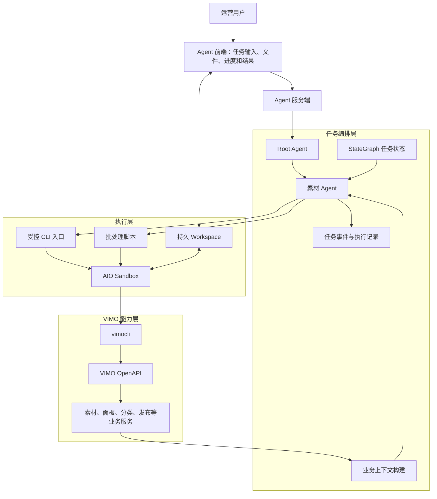

# VIMO 素材 Agent 平台：业务与技术真源

> 文档状态：持续演进中的业务与技术真源，不是简历正文。
>
> 首版日期：2026-07-21。
>
> 最近修订：2026-07-21，补充 Compiler Graph 与 Sandbox 的执行边界。
>
> 使用目的：统一素材 Agent 的业务边界、技术主线、当前事实、目标规划和调研入口。后续简历、面试故事、技术方案和开发规划均从本文提炼，不再直接以早期代码或旧简历草稿作为结论。

## 0. 核心判断

更准确的项目主语不是“一个调用 vimocli 的素材 Subagent”，而是面向运营的任务编译与安全执行环境。

它建立在两层连续能力之上：

```text
第一层：用 vimocli 重新抽象 VIMO GUI 背后的业务操作
第二层：由 Agent 编排原子指令，协助运营完成任务
```

完整主线如下：

```text
VIMO GUI 与业务服务
        |
        v
OpenAPI 稳定契约
        |
        v
vimocli 原子指令
        |
        v
素材 Agent 任务编排
        |
        v
Sandbox + Workspace 执行环境
        |
        v
素材查询、批量治理、面板配置和跨业务线互通
```

目标系统可以概括为：

```text
研发生产平台底座
  StateGraph、策略、审批、运行时、Workspace、审计

运营生产业务玩法
  Scenario、Skill、评测样例

Agent 生产本次执行实例
  Plan、Commands、workflow.sh、Approval Manifest、Result
```

项目要解决的核心问题不是“让模型调用几个接口”，而是完成两次能力转换：

1. 将依赖页面、登录态和人工操作上下文的业务能力，转换为可被人、脚本和 Agent 稳定调用的命令契约。
2. 将运营目标转换为一组有顺序、有数据依赖、有中间产物并可回查结果的原子操作。

StateGraph、编译计划、Skill、Sandbox、Workspace、上下文构建和执行事件都服务于第二次转换，不单独作为项目目标。

---

## 1. 文档边界

### 1.1 内容分级

本文使用四种标记约束事实边界。

| 标记 | 含义 | 写作要求 |
| --- | --- | --- |
| 已确认 | 可以由代码、提交、业务文档或真实命令证明 | 可以作为现状和简历事实候选 |
| 已落地原型 | 已存在实现，但覆盖面、稳定性或生产能力有限 | 需要同时写清当前限制 |
| 目标规划 | 根据业务问题和参考设计形成的目标架构 | 不能直接写成已完成成果 |
| 待调研 | 当前证据不足或存在冲突 | 保留问题和验证入口，不下强结论 |

### 1.2 文档回答的问题

本文重点回答：

1. 素材运营当前有哪些适合由 CLI 和 Agent 承接的任务。
2. 为什么要先建设 vimocli，再建设素材 Agent。
3. GUI 操作应如何抽象成原子指令，而不是机械复制页面按钮。
4. Agent 如何选择、组合和批量执行这些指令。
5. StateGraph、上下文、Sandbox 和 Workspace 分别解决什么工程问题。
6. 当前已经具备哪些基础，距离目标系统还缺什么。
7. 后续应按什么顺序继续调研和建设。

### 1.3 非目标

首版不把以下内容作为默认前提：

1. 不假设所有运营任务都存在复杂审批或多人协作。
2. 不假设 Agent 已经实现完整的长事务、持久恢复和业务验证。
3. 不把当前 Material Subagent 的代码形态等同于最终平台架构。
4. 不把每一个 vimocli 命令包装成独立 Tool。
5. 不把素材 Agent 写成替代运营判断的全自动系统。
6. 不在缺少数据时编造节省人力、任务成功率或处理规模。

---

## 2. 业务背景

### 2.1 VIMO 素材运营对象

素材不是一个孤立文件。一次运营操作可能同时涉及以下对象：

```text
素材 Material
  ├── 基础信息、类型、来源、状态和审核状态
  ├── 资源包、封面、标签、自定义字段和分级
  ├── 业务线、地区、端和环境
  ├── 面板、分类、排序和强插关系
  ├── 分发、发布、历史版本和回滚
  ├── 版权、合同、血缘和复用关系
  └── 自动测试、WebTest、CQ 和端上可用性
```

已确认的 VIMO 业务知识表明：

1. 面板是素材分发的最大单位，分类决定素材在面板中的组织和展示位置。
2. 素材状态与面板关系是两个不同维度；素材下线不必然等同于从所有面板移除。
3. 面板存在草稿、预发布、正式版本、结构化 Diff 和历史回滚。
4. 批量操作覆盖上传、创建、标签、状态、资源替换、分类修复和第三方同步。
5. 自动分发和测试本身已经具有异步任务、状态流转、部分失败和重试语义。

这些对象和状态决定了素材 Agent 不能只根据一句自然语言直接调用写接口。它需要先确定业务对象、操作语义和结果判断方式。

### 2.2 GUI 的能力边界

VIMO GUI 适合人进行可视化查看、少量编辑和异常兜底，但页面不是稳定的程序化调用边界。

典型限制包括：

| 限制 | 具体表现 |
| --- | --- |
| 操作分散 | 素材、面板、分类、发布和辅助批量操作分布在不同页面 |
| 上下文隐含 | 当前业务线、站点、环境、登录态和页面选择不会形成显式调用契约 |
| 单次交互为主 | 页面更适合点击和表单编辑，大批量操作需要导入、循环或额外页面 |
| 难以组合 | 上一步页面结果很难直接成为下一步操作的结构化输入 |
| 难以复现 | 人工点击过程缺少可复用命令和完整输入记录 |
| 难以被 Agent 使用 | Agent 无法依赖易变化的页面结构稳定完成跨页面操作 |

GUI 仍然有明确价值：

1. 展示素材、面板和任务状态。
2. 支持用户查看 Agent 生成的候选清单与结果。
3. 为异常任务提供人工修正和传统操作兜底。
4. 承接文件上传、文件预览和任务进度展示。

目标不是删除 GUI，而是让 GUI 不再是唯一操作入口。

### 2.3 为什么先建设 CLI

vimocli 将页面背后的业务动作转换为显式命令契约：

```text
页面中的素材查询
  -> vimocli material get / search

页面中的素材编辑
  -> vimocli material update / update-custom-info

页面中的面板分类操作
  -> vimocli material panel category ...

页面中的跨业务线运维
  -> vimocli material admin sync ...
```

CLI 带来的变化包括：

1. 输入参数显式化：素材 ID、业务线、环境、面板、分类和目标区域成为命令参数。
2. 输出结构化：支持表格、JSON envelope 和原始 JSON。
3. 结果可组合：查询结果可以进入 `jq`、CSV、JSON 或后续脚本。
4. 操作可复现：命令、参数和输入文件可以保存。
5. 批量可扩展：同构任务可以通过文件输入或脚本集中执行。
6. 调用方统一：运营、研发、CI 和 Agent 使用同一套客户端契约。

### 2.4 为什么 CLI 之后还需要 Agent

CLI 解决“能执行哪些原子操作”，但没有自动解决“如何完成一个运营任务”。

运营任务仍然需要判断：

```text
目标对象是什么
需要查询哪些前置状态
应该选择哪组命令
命令之间如何传递数据
少量任务还是批量任务
失败后继续、跳过还是重新查询
最终应该回查哪些业务状态
```

素材 Agent 的职责是把运营目标拆解为原子操作，并在执行过程中根据真实结果继续调整计划。

---

## 3. 平台定位

### 3.1 两层平台

#### 第一层：原子能力层

原子能力层由 OpenAPI 和 vimocli 构成。

```text
VIMO 业务服务
  -> OpenAPI 契约
  -> Gateway、身份与权限
  -> vimocli 语义命令
  -> 结构化输入输出
```

这一层的目标是让业务能力可调用、可组合、可批处理和可排障。

#### 第二层：任务编排层

任务编排层由素材 Agent、状态图、运行时和工作区构成。

```text
运营输入
  -> 理解目标与范围
  -> 查询素材和面板状态
  -> 选择原子指令
  -> 直接执行或生成批处理
  -> 保存中间产物
  -> 汇总并回查结果
```

这一层的目标是减少运营对命令细节、执行顺序和批量处理逻辑的直接负担。

### 3.2 角色边界

| 角色 | 主要职责 |
| --- | --- |
| 运营用户 | 提供任务目标、业务范围、筛选规则和必要输入；检查候选与结果 |
| 素材 Agent | 理解任务、查询现状、选择指令、组织执行和解释结果 |
| vimocli | 承载稳定的素材、面板、分类和运维原子能力 |
| StateGraph | 管理任务阶段、暂停恢复、失败路由和不可跳过的程序规则 |
| Sandbox | 提供隔离的 CLI、脚本、文件和后续浏览器执行环境 |
| Workspace | 在前端、Agent、CLI 和脚本之间保存任务文件与产物 |
| VIMO 服务 | 执行真实业务查询和变更，并提供最终状态来源 |

### 3.3 平台公式

```text
素材 Agent 平台
  = vimocli 原子能力
  + 业务上下文
  + 任务状态编排
  + Sandbox 执行环境
  + 持久工作区
  + 结果回查
```

其中 vimocli 是能力边界，Agent 是编排者，VIMO 真实业务状态是最终事实来源。

### 3.4 三层生产关系

平台需要把“谁生产什么”拆开，否则每新增一个运营任务都容易退化成研发新增一套 Tool 和 Graph 节点。

| 生产者 | 生产物 | 负责内容 |
| --- | --- | --- |
| 研发 | 平台底座 | StateGraph 生命周期、策略门禁、审批、凭证、Workspace、审计和运行时 |
| 运营 | 业务玩法 | 任务背景、输入输出、筛选规则、常用命令、成功标准和限制 |
| Agent | 执行实例 | 本次任务计划、目标清单、命令、脚本、影响范围和结果报告 |

运营玩法可以通过 `Scenario + Skill + Evals` 进入通用编译图；Agent 只生成本次任务的计划和执行产物，不直接修改平台安全规则。

---

## 4. 支持的业务

### 4.1 原子业务能力

当前 vimocli Skill 已确认覆盖以下能力。

| 领域 | 代表能力 |
| --- | --- |
| 素材 | 查询、搜索、创建、更新、上传、自定义字段、屏蔽、分级和平台配置 |
| 面板 | 面板列表、版本、操作记录和区域查询 |
| 分类 | 分类列表、分类下素材、创建、更新、排序和素材分类分配 |
| 实验 | 实验创建、更新、列表、实验层和状态变更 |
| 运维 | 跨业务线同步资源列表、分类、面板分类和 ClientScene，资源清理和面板素材移除 |

这些命令是 Agent 可以组合的积木，不代表已经存在完整运营任务。

### 4.2 任务一：素材查询与盘点

业务输入可能是素材 ID、名称、业务线、素材类型、面板、分类或一份 CSV/JSON 清单。

任务输出包括：

```text
素材基础信息
素材状态与审核状态
所在面板和分类
业务线、地区和环境
资源包、标签和自定义字段
测试、版权等可获取的扩展状态
```

该任务适合使用 Agent 的原因是查询条件可能不完整，Agent 需要先搜索、补充查询、解释枚举并整理结果，而不是要求运营自己拼接多个命令。

### 4.3 任务二：素材批量治理

素材治理包括但不限于：

```text
批量修改素材状态
批量屏蔽
从分类移除
从面板移除动态素材
修改标签、运营标签、质量分和商用标记
替换资源包或封面
修复素材与分类数据不一致
```

“下线”必须继续拆分为具体业务动作：

| 业务意图 | 可能对应的真实操作 |
| --- | --- |
| 不允许素材继续使用 | 修改素材状态或屏蔽 |
| 不希望在某个入口展示 | 从指定面板或分类移除 |
| 暂停正式分发 | 修改发布或分发关系 |
| 清理错误配置 | 修复面板分类关系 |
| 彻底删除数据 | 高风险物理删除，不能与普通下线混用 |

典型治理规则可以组合上线时间、消费数据、导出排名、展导率、安全合规结果和白名单。规则来源和准确字段仍需按具体任务确认，不能将某次运营口径固化为全平台默认规则。

### 4.4 任务三：跨业务线素材互通

业务资料确认了三类复用诉求：

1. 跨业务线复用已经验证高收益的素材。
2. 同一业务线在海内外或不同机房之间复用素材。
3. 同一业务线在不同场景、面板或端之间复用供给。

素材互通不是一个单一的 `copy material` 动作。至少需要明确：

```text
源业务线和目标业务线
源地区、目标地区和目标端
素材类型与来源
映射还是复制
资源、分类、面板和 ClientScene 的同步范围
目标业务线是否已经存在对应内容
最终如何验证目标侧可见和可用
```

业务资料中还存在版权、血缘、POC、IE 改包和测试等扩展设想。它们具有业务价值，但当前是否纳入首期 Agent 平台、具体由哪个系统承接，仍需继续确认，不能作为平台已经具备的基础能力。

### 4.5 任务四：面板与分类配置

面板配置涉及草稿、预发布、正式态和历史版本，任务可能包括：

```text
查询面板和分类结构
创建或编辑分类
调整分类顺序
批量添加或移除素材
查询改动记录和版本
生成发布前差异
发布后回查正式态
```

此类任务适合由 Agent 协助整理配置和执行原子操作，但结构化 Diff、发布规则和回滚能力应继续由 VIMO 服务端保证，不能让模型重新实现一套发布算法。

---

## 5. 全局架构

### 5.1 架构图



### 5.1.1 编译图与 Sandbox 的交互

```text
Compiler Graph
  ├── resolve：加载 Scenario、Skill、输入和运行上下文
  ├── probe：用单条 vimocli 探测参数、数据和返回结构
  ├── plan：生成目标集合、操作顺序和成功标准
  ├── compile：选择直接命令或 workflow.sh
  ├── gate：校验影响范围、权限和脚本版本
  ├── execute：通过 SandboxConnection 执行
  └── verify：读取结果文件并回查 VIMO 真实状态

Sandbox
  ├── 直接命令：执行一条 vimocli，返回摘要给 Agent
  ├── 批处理：执行 workflow.sh，保存逐项结果到 Workspace
  └── read：按需读取失败项、日志和最终报告
```

编译图不直接实现素材业务接口，Sandbox 也不负责理解运营任务。前者决定“执行什么以及如何观察”，后者负责“在隔离环境中把命令跑起来”。

### 5.2 关键调用链

```text
用户提出任务
  -> Root Agent 判断属于素材域
  -> 加载 Scenario、Skill 和评测约束
  -> Compiler Graph 绑定输入并探测 CLI
  -> 生成本次任务的执行计划
  -> 根据观察粒度选择直接命令或批处理脚本
  -> Sandbox 执行单条 vimocli 或 workflow.sh
  -> 结构化返回摘要、结果文件和日志路径
  -> Agent 只在需要时读取明细并重新规划
  -> 回查 VIMO 状态并生成结果
```

### 5.3 当前实现与目标架构的差异

当前 Material Subagent 已经建立 Root Agent、业务子 Agent、Skill、受控 CLI、Sandbox 文件/脚本和事件流的基本关系，但它仍然更接近一个 CLI 驱动的 Agent 原型：

1. Material Agent 的声明当前标记为 `asDeepAgent=false`，现有 Agent 工厂也没有为它建立独立的持久状态图。
2. Checkpointer 当前使用进程内 `MemorySaver`，服务重启后不能恢复。
3. Sandbox Session 主要按用户复用，不是任务拥有独立 Workspace。
4. 前端暂不支持用户把本地文件上传给 Material Agent。
5. 写操作审批和命令策略没有形成不可绕过的程序边界。
6. 当前结果主要来自 CLI 返回和 Agent 回读，没有统一的业务级验证协议。
7. 当前 `managed_cli_run` 仍以一次调用执行一条 CLI 为主，脚本执行又不会继承 vimocli 的业务线和用户凭证，尚未形成“脚本内批量调用 vimocli”的统一执行面。

这些差异是后续规划的真实起点。

---

## 6. 核心技术设计

### 6.1 GUI 到 CLI 的能力抽象

#### 6.1.1 抽象原则

CLI 不应逐个复制页面按钮，也不应逐个暴露底层 RPC。命令需要围绕稳定业务对象和动作组织：

```text
资源：material / panel / category / experiment
动作：get / search / create / update / list / sync / remove
上下文：biz / bid / site / env / area
输入：参数、JSON 或文件
输出：table / JSON / raw JSON / exit code
```

一个命令是否适合作为原子能力，可以用以下标准判断：

1. 输入和输出能够形成稳定契约。
2. 操作语义可以独立解释，不依赖具体页面布局。
3. 失败能够用错误码、退出码或结构化信息表达。
4. 可以被人直接使用，也可以被脚本和 Agent 调用。
5. 高风险动作的影响范围可以在执行前明确展示。

#### 6.1.2 两层命令体系

已确认的 OpenAPI/CLI 项目采用两层思路：

```text
语义命令
  面向高频业务动作，参数和输出对人、脚本和 Agent 友好

生成命令
  面向 OpenAPI 契约覆盖，降低接口增长后的人工维护成本
```

素材 Agent 默认优先使用语义命令；只有语义命令缺失时，才评估生成命令或补充新的原子能力。

#### 6.1.3 运行时上下文

vimocli 已经收敛以下通用上下文：

```text
业务线 biz / bid
国内和海外 site
个人 JWT 或服务账号
Gateway 请求头
PPE 泳道路由
超时和调试信息
表格、JSON 和 raw JSON 输出
```

Agent 不应在 Prompt 中拼接 JWT、站点和请求头。当前实现已经将业务线和用户 JWT 作为请求级运行时变量注入受控 vimocli 执行，不写入通用脚本和长期 Session 环境。

#### 6.1.4 文件和批量输入

CLI 是连接 Agent 与 Workspace 的关键位置。

```text
少量参数
  -> 命令行参数或 JSON 字符串

大批量关系
  -> assignments-file / items-file / CSV / JSON

查询驱动任务
  -> --raw / --json + jq / Node 脚本
```

批量任务不应把数百个 ID 全部塞进模型上下文。Agent 应将清单写入 Workspace，再让 vimocli 或脚本读取文件。

### 6.2 Agent 对原子指令的编排

#### 6.2.1 任务处理模式

素材任务至少分为三种执行方式。

| 模式 | 适用条件 | 执行方式 |
| --- | --- | --- |
| 单条探索 | 对象少、命令不确定或需要观察返回 | Agent 逐条执行 vimocli 并根据结果继续 |
| 批量执行 | 对象多、参数结构一致或由文件驱动 | 生成输入文件和批处理脚本集中执行 |
| 固定流程 | 顺序和规则由服务端业务约束 | 调用 VIMO 已有异步任务、发布、测试或分发能力 |

关键取舍是：Agent 可以探索命令，但不应该重新实现服务端已有的批量、发布和状态机能力。

#### 6.2.2 从探索到批处理

```text
读取任务目标
  -> 用代表性素材验证查询命令
  -> 确认字段、返回结构和错误语义
  -> 生成候选清单
  -> 小规模抽样验证
  -> 生成批处理脚本或文件输入
  -> 执行并记录逐项结果
```

进入批处理前需要确认：

```text
命令模板已经跑通
输入文件格式明确
失败项能够单独记录
批次和限速策略明确
不可逆操作能够预览影响范围
写操作结果能够回查
```

#### 6.2.3 为什么不把每个命令注册成 Tool

vimocli 命令面会随 OpenAPI 和素材业务持续扩展。为每个命令创建独立 Tool 会产生重复契约、重复权限和工具数量膨胀。

当前更合适的边界是：

```text
Skill
  描述命令、参数约束和业务使用方式

受控 CLI 入口
  统一执行 vimocli、注入运行时上下文并返回结构化结果

Agent
  选择和组合命令

代码节点
  承担不能交给模型自由决定的固定规则
```

#### 6.2.4 Compiler Graph 的职责

这里的“编译”不是把自然语言直接翻译成一条 Shell 命令，而是把任务编译成一组可执行、可审计、可恢复的任务产物。

固定的 StateGraph 负责生命周期和治理边界；本次任务的动态计划由编译阶段生成。

```text
加载 Scenario / Skill
  -> 绑定用户输入和 Workspace 文件
  -> 读取业务上下文
  -> 探测命令能力和返回结构
  -> 生成目标集合与操作计划
  -> 判断直接执行还是批处理
  -> 生成 command / workflow.sh / verify 规则
  -> 进行风险和影响范围分析
  -> 进入执行或人工确认节点
```

编译产物至少包括：

```text
plan.json              本次任务的阶段和操作计划
targets.json           目标素材及筛选原因
commands.json          代表性命令和参数
workflow.sh            批处理脚本，可选
approval.json          影响范围、写操作和脚本哈希
verify.json            执行完成后的回查条件
```

这些产物写入 Workspace，既是执行输入，也是人工检查、任务恢复和后续评测的依据。

#### 6.2.5 Agent 什么时候需要感知 vimocli

Agent 需要看到每条 `vimocli` 结果的场景，是结果会影响下一步决策的场景：

| 场景 | 为什么需要逐条感知 |
| --- | --- |
| 命令参数或子命令不确定 | 需要查看 `--help`、错误信息或实际返回结构 |
| 第一次处理某类素材 | 需要确认字段、业务状态和命令语义是否符合预期 |
| 少量独立操作 | 逐条结果本身就是用户需要的答案 |
| 查询结果决定下一步 | 例如根据当前分类关系决定使用新增、覆盖还是移除 |
| 发生业务异常 | 需要读取失败原因并重新规划，而不是继续套用原命令 |
| 写操作结果不确定 | 需要先查询真实状态，确认是否已经产生副作用 |

这时执行路径是：

```text
Compiler Graph 节点
  -> bash / managed CLI 入口
  -> Sandbox 执行单条 vimocli
  -> 返回结构化摘要
  -> Graph 或 Agent 判断下一节点
```

可以先用一个简单的观察粒度规则作为默认策略：

| 任务形态 | 默认方式 | Agent 观察方式 |
| --- | --- | --- |
| 一两条独立命令 | 直接执行 | 感知每条 `vimocli` 返回 |
| 参数未知但对象很少 | 先单条探测 | 感知返回并修正计划 |
| 四条以上同构操作 | 编译为脚本 | 只看汇总和失败项 |
| 文件驱动、需要循环或限速 | 编译为脚本 | 读取结果文件和日志 |
| 固定发布、分发或测试流程 | 进入固定代码节点 | 由节点读取业务状态 |

数量只是默认提示，最终还要结合风险、命令确定性和结果依赖判断。

#### 6.2.6 什么时候直接使用 sh/node 批处理

当任务已经从“探索一个命令”变成“对大量对象重复执行同一个操作”时，不应该让 Agent 逐条感知结果。

进入脚本模式的条件包括：

```text
同一命令模板需要执行很多次
输入来自 CSV/JSON 文件
需要循环、过滤、排序或限速
失败项需要与成功项分开保存
任务需要可复现、可重跑或可审计
```

脚本模式的关键不是绕过 vimocli，而是改变观察粒度：

```text
Agent 负责：生成计划、清单和脚本，检查脚本风险
Sandbox 负责：执行 workflow.sh 或 Node 脚本
vimocli 负责：执行每一条真实业务操作
脚本负责：循环、分批、限速、收集结果和写日志
Agent 负责：消费最终汇总，必要时读取失败项并重新规划
```

典型执行方式：

```bash
while read -r rid; do
  vimocli --raw material get --rids "$rid" >> results.jsonl
done < targets.txt
```

或者：

```bash
node /workspace/jobs/run-123/workflow.js
```

这里的 `sh/node` 是任务编排层，不是新的业务能力层；业务动作仍然由 vimocli 完成。

#### 6.2.7 两种执行方式的统一入口

目标架构中，Agent 只需要感知受治理的 `bash` 和 `read`：

```text
直接模式：
  bash("vimocli --raw material get --rids A123")

脚本模式：
  bash("bash /workspace/jobs/run-123/workflow.sh")
  read("/workspace/jobs/run-123/result.json")
```

两者不是两套业务 Tool，而是同一个 Sandbox 执行连接的两种调用形态。

```text
SandboxConnection.execute(command)
SandboxConnection.read(path)
```

区别只在于：

```text
直接模式：命令结果返回给 Agent，Agent 参与下一步判断
脚本模式：中间结果留在文件，Agent 主要消费最终汇总
```

#### 6.2.8 脚本如何安全调用 vimocli

脚本批量调用 vimocli 时，不能把原始 JWT 写入脚本、Workspace 或命令日志。目标执行面需要提供 CLI Shim 或受控子进程：

```text
workflow.sh
  -> 受控 vimocli shim
  -> 从当前 Sandbox 运行上下文获取短期凭证
  -> 注入当前业务线、站点和请求身份
  -> 执行真实 vimocli
  -> 统一记录 command_id、exit_code 和结果文件
```

脚本可以拿到“调用能力”，不能拿到原始凭证，也不能绕过：

```text
命令 allowlist
Workspace 路径限制
写操作策略
脚本内容或 hash 校验
结果日志和操作流水
```

当前实现存在明确缺口：`script-runner-tool.ts` 为通用脚本执行设计，明确不注入业务线和 JWT；`managed-cli-tool.ts` 又主要以 `cli + args[]` 执行单条命令。因此目标架构需要增加受控的脚本内 CLI 调用层，而不是让 Agent 退化为数百次独立 `managed_cli_run`。

### 6.3 StateGraph 任务状态

#### 6.3.1 状态图的职责

StateGraph 不负责保存所有业务知识，也不应该为每个素材创建一张复杂子图。它主要管理任务阶段：

```text
初始化
  -> 构建上下文
  -> 探索与查询
  -> 生成计划
  -> 执行
  -> 结果回查
  -> 完成或继续处理失败项
```

需要人工确认或高风险写入时，可以在计划与执行之间增加中断节点，但是否需要审批应由具体业务场景决定，不作为所有任务的强制前提。

#### 6.3.2 固定图与动态计划

需要区分两种“图”：

```text
平台固定图
  研发维护
  控制加载、探测、计划、风险判断、执行、验证和完成的生命周期

任务动态计划
  Agent 根据本次输入生成
  决定目标素材、命令参数、脚本内容、观察粒度和回查条件
```

固定图不能被 Agent 随意跳过，动态计划也不能直接获得平台最高权限。两者的交互点是编译节点：

```text
固定图进入编译节点
  -> 读取 Scenario / Skill / 输入文件
  -> Agent 探索并生成计划
  -> 编译器校验计划结构和风险
  -> 输出直接命令或 workflow.sh
  -> 固定图决定是否允许进入执行节点
```

这样既不需要每个运营玩法都重新开发 Graph，也不会让模型直接控制执行边界。

#### 6.3.3 阶段状态与素材台账分离

千级素材任务不能在 Graph 中为每个素材展开大量节点。更合理的模型是：

```text
StateGraph
  保存任务当前处于查询、计划、执行还是验证阶段

素材执行台账
  保存每个素材的输入、操作、状态、错误和下一步动作
```

素材台账建议包含：

```text
task_id
material_id
operation
status
attempt
operation_id
error_code
error_message
result_ref
next_action
updated_at
```

状态至少区分：

```text
pending
running
succeeded
failed_retryable
failed_terminal
skipped
unknown
```

`unknown` 用于表达写请求超时后无法确认是否已经生效，不能直接当作失败重试。

#### 6.3.4 持久恢复

目标系统需要将以下状态关联到同一个 `task_id/thread_id`：

```text
Graph checkpoint
当前节点
任务输入
候选清单
执行台账
Workspace 身份
CLI 操作记录
最终结果
```

Checkpointer 只负责恢复 Agent/Graph 状态，不会自动恢复 Sandbox 文件或运行中的 Shell。Workspace、Sandbox binding 和执行台账必须独立持久化。

### 6.4 业务上下文

#### 6.4.1 上下文不是聊天记录

素材 Agent 需要的上下文可以分为五类：

| 类型 | 内容 |
| --- | --- |
| 任务上下文 | 用户目标、业务范围、输入文件、筛选条件和输出要求 |
| 业务对象 | 素材、面板、分类、业务线、地区、端和环境 |
| 业务证据 | 素材详情、消费表现、版权、血缘、测试和发布状态 |
| 执行上下文 | 已执行命令、返回摘要、结果文件和失败项 |
| 平台上下文 | 当前可用 Skill、CLI 版本、Sandbox 和 Workspace 信息 |

聊天历史只是一种输入，不应成为上下文的唯一存储形式。

#### 6.4.2 按阶段构建最小上下文

不同任务阶段需要的上下文不同：

```text
查询阶段
  任务目标 + 查询条件 + 素材和面板字段定义

计划阶段
  候选清单 + 操作语义 + 当前状态 + 风险信息

执行阶段
  冻结后的目标集合 + 命令参数 + Workspace 文件路径

结果阶段
  执行台账 + VIMO 回读状态 + 失败详情
```

上下文构建器的目标是按阶段读取必要内容，而不是把全部业务文档、全部 CLI 输出和全部聊天记录塞进 Prompt。

#### 6.4.3 证据引用

Agent 的关键判断需要能够指向真实证据：

```text
素材 ID 和查询时间
来源服务或命令
业务线、环境和地区
原始结果文件路径
筛选规则版本
```

对于会变化的数据，应在 Workspace 中保存任务时点的快照，避免恢复任务后因为实时数据变化而无法解释原有候选结果。

### 6.5 Workspace 文件系统

#### 6.5.1 Workspace 的角色

Workspace 是前端、Agent、CLI 和脚本共同使用的任务目录，不只是保存临时脚本。

```text
前端上传 CSV/JSON
        |
        v
任务 Workspace
        |
        +--> Agent 读取输入
        +--> CLI 使用文件参数
        +--> 脚本读取候选清单
        +--> 保存完整日志和失败项
        +--> 前端查看或下载结果
```

它解决的是任务文件跨轮次、跨 Sandbox 和人机交接时的连续性。

#### 6.5.2 demoagent 的两代实现

参考仓库 `demoagent` 提供了两种 Workspace 持久化方式。

第一代是内容快照：

```text
递归列举 Sandbox 文件树
  -> 下载文件
  -> 计算 SHA-256
  -> 相同内容复用对象存储 Blob
  -> Mongo 保存 session/version/path 元数据
  -> 删除文件写 tombstone
  -> Redis 缓存 manifest
  -> 新 Sandbox 逐文件恢复
```

这套方案适合历史版本、不可变归档和恢复，但需要处理隐藏文件、空目录、权限、大目录恢复、逐文件上传和前端 snapshot 状态。

第二代是 TOS 挂载：

```text
Conversation/Workspace 拥有稳定 TOS sub_path
  -> 创建 Sandbox 时传入 tos_mount_params
  -> AIO 将 TOS 目录挂载到 workspace root
  -> Agent 和用户直接读写挂载目录
  -> Sandbox 销毁后，新 Runtime 挂载同一 sub_path
```

该方案的核心判断是：

```text
Workspace 是持久身份
Sandbox Runtime 是可替换执行容器
```

参考代码使用 `bytedance.bytedai[sandbox]==0.3.43` 的 `TOSMountParam`，由 Agent 服务端生成 bucket、sub_path、mount_path 和只读参数，再通过 `create_session(..., tos_mount_params=...)` 交给 AIO 平台完成挂载。

注意：参考仓库的设计文档仍标记为 Draft，本文只将其作为已存在的参考实现和设计方向，不代表 VIMO 已完成同等能力。

#### 6.5.3 VIMO 目标模型

目标 Workspace 不应直接依附聊天 Session，也不应只用 Sandbox ID 标识。建议使用独立任务身份：

```text
Task
  -> workspace_id
  -> stable TOS sub_path
  -> current sandbox_runtime_id
```

建议数据模型：

```text
workspace_id
task_id
owner
provider
sub_path
mount_path
mode
status
active_runtime_id
current_revision
quota
retention_policy
created_at
updated_at
```

其中 `workspace_id/sub_path` 长期稳定，`sandbox_runtime_id` 可以更换。

#### 6.5.4 前端到 Sandbox 的链路

前端不能直接操作 TOS 凭证和真实路径。完整链路应为：

```text
前端文件面板
  -> conversation/task scoped 文件 API
  -> 后端校验用户、task_id 和目标路径
  -> 根据 Workspace binding 找到 Sandbox Runtime
  -> AIO file.list/read/upload/download
  -> Sandbox 内挂载目录
  -> TOS sub_path
```

Agent 或 CLI 在 Sandbox 中写入同一个挂载目录后，前端刷新文件树即可看到结果。两者使用的是同一个文件系统视图，不需要在前端和 Sandbox 之间复制一份文件。

#### 6.5.5 目录契约

建议为素材任务固定目录语义：

```text
/workspace
├── inputs/        用户输入和原始清单
├── evidence/      业务数据与筛选证据快照
├── plans/         候选清单和执行计划
├── scripts/       批处理脚本
├── work/          临时计算文件
├── outputs/       成功、失败和最终结果
├── logs/          CLI 与脚本完整日志
└── .runtime/      Agent、索引和工具内部状态
```

目录契约解决三个问题：

1. Agent 知道不同文件应该写到哪里。
2. 前端可以按业务含义展示文件，而不是展示无序目录。
3. 关键输入、执行计划和结果可以采用不同的可修改策略。

#### 6.5.6 在线目录与历史版本

TOS 挂载适合承载当前可变工作目录，但不能天然回答“执行的是不是用户刚刚确认的那一版文件”。

目标方案应采用混合模型：

```text
TOS Mount
  保存当前在线 Workspace

Workspace Revision
  保存关键节点的不可变文件版本和 Graph checkpoint 关联
```

建议在以下节点创建版本：

```text
候选清单确认
批处理脚本生成完成
执行开始前
批量执行结束
人工接管前后
任务完成
```

版本至少记录：

```text
revision
parent_revision
graph_checkpoint_id
关键文件 hash
创建者
创建原因
创建时间
```

#### 6.5.7 并发与安全

同一个 TOS 路径被多个 Sandbox 同时读写会形成共享可变状态。目标系统需要明确：

```text
同一 Workspace 默认只有一个读写 Runtime
其他 Runtime 只读挂载或显式 Clone/Fork
Runtime 失效后才能将写权限切换给新 Runtime
```

前端只传 `task_id/workspace_id` 和受限相对路径，不能传 bucket、AK/SK 或任意 TOS sub_path。后端负责路径标准化、越界校验、挂载参数生成和脱敏诊断。

参考仓库当前使用 `chmod -R 777` 处理挂载目录权限，这种方式适合作为集成阶段兜底，不应直接作为长期生产安全模型。后续应继续调研 Sandbox 用户、TOS Mount 权限和短期凭证能力。

#### 6.5.8 大文件和文件树性能

前端上传文件不应长期采用“完整读入 Agent 后端内存再上传”的方式。目标链路应支持：

```text
后端校验 Workspace 和目标路径
  -> 签发短期上传地址
  -> 前端分片直传 TOS
  -> 后端登记文件元数据
```

大目录也不应每次递归扫描。可以为前端维护轻量文件索引，并通过文件工具事件与周期性对账更新。该能力属于后续优化，不是首期必须条件。

### 6.6 执行可靠性

#### 6.6.1 当前基础

当前受控 CLI 入口已经具备：

```text
CLI 白名单
请求级业务线和 JWT 注入
结构化执行结果
stdout/stderr 截断
完整输出写入 /workspace/.outputs
只读 vimocli HTTP 500 有界重试
tt-logid 收集
工具执行事件
```

这些能力解决的是 CLI 运行稳定性和排障问题。

#### 6.6.2 读写错误分开处理

```text
只读请求
  网络失败、429、临时 5xx可以有限重试

写请求
  超时或 5xx 可能已经产生副作用，不能直接重放
```

写操作需要 OpenAPI/CLI 提供更明确的执行契约：

```text
idempotency_key
operation_id
expected_version
dry_run
status_query
```

如果底层接口不具备这些能力，Agent 层无法仅靠提示词保证安全重试。

#### 6.6.3 当前写操作边界

当前 Material Agent Prompt 要求写操作前查询现状、展示影响并由用户确认，执行后回查。但 Root 和 Material Agent 的 `interruptOn` 目前均为 false，命令策略开关也没有强制开启。

因此当前属于行为约束，不是不可绕过的程序边界。目标系统需要根据实际业务风险决定哪些操作必须进入状态图确认节点或独立写入执行器。

### 6.7 结果回查

CLI 退出码为 0 只表示命令执行成功，不一定表示运营任务完成。

需要区分三层结果：

```text
命令成功
  CLI 进程和请求执行成功

操作成功
  指定素材或面板变更已经生效

任务成功
  用户要求的全部对象得到正确处理，失败项和遗漏项已经解释
```

不同任务需要不同回查方式：

| 任务 | 回查内容 |
| --- | --- |
| 素材更新 | 素材字段、状态和版本 |
| 屏蔽 | 屏蔽记录和素材可见性 |
| 分类分配 | 素材在目标分类中的最终关系 |
| 面板移除 | 指定面板/分类不再包含目标素材 |
| 跨业务线同步 | 目标业务线的资源、分类和 ClientScene 状态 |
| 发布 | 正式版本、Diff 和目标环境内容 |

首期可以由 Agent 执行明确的查询命令回查；后续再将高风险任务的验证固化为代码规则。

### 6.8 事件与观测

当前 Agent Runtime 已经可以将以下动作转换为前端事件：

```text
运行时上下文
Skill 加载
Subagent 委派
CLI 开始与结束
脚本开始与结束
文件写入
工具重试
错误和完成
```

后续任务级观测建议统一以下编号：

```text
task_id
thread_id
turn_id
subagent_run_id
tool_call_id
command_id
sandbox_id
workspace_id
operation_id
```

前端展示应面向可验证事实：当前阶段、执行的命令、输入文件、结果数量、失败原因和日志入口，不展示模型隐式思考过程。

### 6.9 Skill 与经验演进

Skill 当前主要描述 vimocli 命令、参数规则、批量脚本建议和业务操作注意事项。

后续可以把线上失败沉淀为：

```text
失败任务
  -> 区分 CLI 参数、接口契约、业务数据和运行时问题
  -> 形成可复现样例
  -> 修改 Skill 或平台代码
  -> 使用历史样例回放
  -> 人工审核后发布
```

Agent 不应直接修改线上 Skill。Skill 更新需要版本、测试样例和审核入口。

---

## 7. 典型业务链路

### 7.1 单素材查询

```text
用户输入素材 ID
  -> 素材 Agent 加载 vimocli 素材能力
  -> material get 查询详情
  -> 必要时查询面板分类关系
  -> 将枚举、状态和关键字段转成运营可读结果
```

该任务不需要脚本、持久状态图或复杂 Workspace。

### 7.2 文件驱动的批量治理

```text
前端上传 materials.csv
  -> 文件进入任务 Workspace/inputs
  -> Agent 读取清单和治理规则
  -> 查询素材当前状态及所在面板
  -> 生成 plans/candidates.json
  -> 运营检查候选范围
  -> Agent 生成 scripts/execute.js 或 vimocli 文件输入
  -> Sandbox 批量执行
  -> outputs/success.json
  -> outputs/failed.json
  -> Agent 回查失败和关键成功项
  -> 输出最终治理结果
```

该链路证明的不是 Agent 会调用更新接口，而是前端文件、Workspace、查询、批处理和结果回查能够共同工作。

### 7.3 低效素材下线

一个可规划但需要继续确认字段和数据源的流程：

```text
运营选择业务线、面板/分类和统计周期
  -> 获取目标范围内素材
  -> 获取上线时间和消费表现
  -> 应用本次任务的阈值与白名单
  -> 输出逐素材入选/排除原因
  -> 运营确认具体动作：状态下线、屏蔽或面板移除
  -> 生成对应批量计划
  -> 执行
  -> 回查素材状态和面板关系
```

这里的关键是先确定“下线”的真实业务语义，再选择 vimocli 原子能力。

### 7.4 跨业务线素材互通

```text
运营输入源业务线、目标业务线、地区、端和素材范围
  -> 查询源素材、分类和面板关系
  -> 预览源与目标分类映射
  -> 确定需要同步的资源、分类、面板分类或 ClientScene
  -> 生成操作计划和输入文件
  -> 分阶段执行 vimocli admin sync
  -> 回查目标业务线内容
  -> 输出已同步、跳过、冲突和失败项
```

版权、血缘、改包和端上测试可以作为后续子任务接入，但必须先确认真实服务、数据契约和责任边界。

### 7.5 面板分类批量调整

```text
查询当前面板和分类树
  -> 查询目标素材现有分类分配
  -> Agent 根据输入生成 assignments.json
  -> 先展示将新增、移除和清空的关系
  -> 调用 set/add/remove assignments
  -> 回查分类分配结果
  -> 必要时由 VIMO 原有发布链路生成 Diff 并发布
```

Agent 不自行拼装正式发布数据，只操作 VIMO 提供的草稿和分配原子能力。

---

## 8. 当前事实与目标差距

| 维度 | 当前事实 | 目标规划 | 主要差距 |
| --- | --- | --- | --- |
| 业务定位 | Material Subagent 处理素材域 vimocli 任务 | 支持查询、治理、面板和互通任务编排 | 缺少任务级输入输出契约 |
| CLI | 素材、面板、分类、实验和运维命令已经形成 Skill | 补齐目标业务需要的原子能力和回查命令 | 需要持续核对命令覆盖与真实业务语义 |
| 编排 | Root Agent 委派 Material Agent，Agent 自主选择命令 | StateGraph 管任务阶段，素材台账管批量项 | Material Agent 当前没有独立持久 Graph |
| 上下文 | 请求级业务线/JWT、Skill 和最近消息 | 按任务阶段构建业务上下文和证据引用 | 缺少统一上下文模型和外部数据接入 |
| 执行 | managed_cli_run、文件读写和 Node 脚本 | 单条探索、文件批量和固定服务端流程分级执行 | 当前脚本不能继承 vimocli 业务线/JWT，批量任务只能退化为重复单条调用 |
| Sandbox | AIO Session 可创建、复用和重连 | Sandbox 作为可替换执行容器 | 当前 Workspace 仍依附 Session |
| Workspace | 临时 `/workspace` 和大结果文件 | 任务级 TOS 挂载、前端文件面板和历史版本 | 未实现用户上传和跨 Runtime 持久目录 |
| 恢复 | LangGraph MemorySaver、Redis 保存 Sandbox Session 映射 | 持久 Checkpointer + Workspace + 执行台账 | 服务重启后 Agent 状态无法恢复 |
| 可靠性 | 只读 HTTP 500 重试、tt-logid、事件流 | 写操作幂等、未知结果查询、任务级重试 | 底层 OpenAPI/CLI 契约需要增强 |
| 验证 | Agent 根据 CLI 结果继续查询 | 高风险任务使用业务规则验证 | 缺少统一验证定义和结果模型 |
| Skill | vimocli Skill 随代码和 Skill 平台发布 | 失败样例、回放测试和版本审核 | 缺少任务级评测数据集 |

---

## 9. 时间线

### 9.1 已确认演进

| 时间 | 阶段 | 已确认内容 |
| --- | --- | --- |
| 2026-05-30 | DeepAgents/AIO Sandbox 方案 | 明确 Root Agent、业务 Agent、Skill、CLI、文件和 Sandbox 的基础分层 |
| 2026-06-11 至 06-14 | Sandbox Session 基础 | CLI 授权、Session 复用、Redis Key、Sandbox PSM 和运行时连接逐步收敛 |
| 2026-06-22 | Material Agent 接入 | 注入 vimocli 业务线运行时上下文，并将素材任务路由到 Material Subagent |
| 2026-06-23 | 上下文与可靠性 | 增加运行时上下文事件、vimocli HTTP 500 重试和 Material 运行时上下文稳定性处理 |
| 2026-06-24 | 素材 Agent 基础能力 | 形成 Material Subagent、managed CLI、脚本、事件时间线和前端运行时上下文；合并前累计 49 个文件、约 1894 行新增 |
| 2026-06-25 | 能力收口 | 以“素材 agent 基础能力”提交整理阶段成果 |
| 2026-06-26 | Agent 基建合流 | 活动 Agent 升级合入主干，DeepAgents/AIO 基础能力继续收敛 |
| 2026-07-20 至 07-21 | 业务与目标架构梳理 | 重新以“CLI 原子能力 + Agent 任务编排”为主线，补充真实运营业务和 Workspace 参考设计 |

### 9.2 后续演进建议

```text
阶段一：补齐前端文件入口与任务 Workspace
阶段二：建立任务输入、执行计划和素材台账
阶段三：落地一个真实素材治理任务
阶段四：扩展跨业务线互通和业务结果验证
阶段五：补持久恢复、任务回放和 Skill 评测
```

---

## 10. 建设规划

### 10.1 第一阶段：文件与任务基础

目标：让用户、Agent 和脚本围绕同一个任务目录工作。

```text
任务 ID 与 Workspace ID
前端文件上传、文件树和结果下载
Sandbox 创建时挂载任务 Workspace
固定目录契约
任务与 Sandbox binding
```

验收 Case：运营上传一份素材清单，Agent 在 Sandbox 中读取并生成结果文件；Sandbox 重建后文件仍然存在。

### 10.2 第二阶段：任务编排

目标：将一次对话升级为有阶段、有输入输出的任务。

```text
任务输入结构
StateGraph 阶段状态
Compiler Graph 编译节点
候选清单与执行计划
素材级执行台账
直接执行与批量执行选择
脚本内 vimocli 受控调用
任务事件和进度展示
```

验收 Case：针对一批素材先用单条 vimocli 探测并确认返回结构，再编译为 workflow.sh 批量执行；Agent 不逐条消费中间结果，但可以读取失败项并继续处理。

### 10.3 第三阶段：素材治理任务

目标：落地一个规则可解释、结果可回查的真实运营任务。

优先选择：

```text
文件驱动的素材状态盘点
批量分类分配调整
低效素材候选生成与指定动作执行
```

验收重点不是自然语言回答质量，而是候选正确性、批量执行结果和回查一致性。

### 10.4 第四阶段：跨业务线互通

目标：将已有 admin sync 原子能力组合为任务流程。

```text
源目标业务线和地区建模
分类映射预览
资源、分类、面板分类和 ClientScene 分阶段同步
冲突和跳过项记录
目标侧回查
```

版权、血缘和测试在真实服务与契约确认后按子任务接入，不在首期一次性实现。

### 10.5 第五阶段：可靠性与演进

```text
持久 Checkpointer
写操作幂等与状态查询
Workspace Revision
失败任务回放
Skill 版本和测试集
任务质量指标
```

---

## 11. 评估指标

### 11.1 业务结果

```text
任务完成率
素材正确处理率
失败项可解释率
批量任务人工返工率
跨业务线同步正确率
```

### 11.2 执行质量

```text
CLI 首次成功率
只读重试成功率
批量部分失败率
未知结果占比
任务恢复成功率
平均命令数和脚本执行时长
```

### 11.3 Agent 行为

```text
无效命令比例
重复查询比例
命令参数修正次数
少量任务误生成脚本比例
大批量任务逐条调用比例
回查覆盖率
```

指标只在真实埋点和任务数据具备后填写数值，当前不提前承诺收益。

---

## 12. 待调研问题

### 12.1 业务

1. 素材治理首个真实任务是什么，输入字段、筛选规则和执行动作分别由谁确认。
2. 风神消费数据的查询入口、字段口径、更新频率和权限是什么。
3. 素材互通一期是否只编排现有 admin sync，还是需要纳入素材复制、版权和血缘服务。
4. “下线”“移除面板”“屏蔽”“停止分发”的运营口径是否已经有统一说明。
5. 哪些任务必须人工确认，哪些只需要展示计划和结果。

### 12.2 CLI

1. 当前素材治理任务仍缺哪些语义命令。
2. 写操作是否具备 dry-run、幂等键、操作 ID 和状态查询。
3. 批量命令的单次上限、限流和部分失败协议是否一致。
4. 面板发布和正式态回查是否已经完整开放给 vimocli。
5. CLI 与 Skill 版本如何关联和回滚。

### 12.3 Agent Runtime

1. Material Agent 是否升级为独立 DeepAgent/StateGraph，还是由平台通用任务图承载。
2. Checkpointer 采用哪种持久化存储，如何与现有 conversation/thread 模型对齐。
3. 当前按 operator 复用 Sandbox Session 是否需要改为按 task/workspace 绑定。
4. 写操作的程序性边界放在 managed CLI、StateGraph 还是专用执行器。
5. 前端事件是否需要新增任务阶段、批次进度和素材级失败统计。

### 12.4 Workspace

1. VIMO AIO Sandbox 是否可以直接使用 `TOSMountParam.sub_path`，需要什么 PSM 和权限。
2. Workspace 采用 conversation、task 还是独立 workspace 作为身份。
3. 是否允许多个 Sandbox 同时挂载同一目录，读写一致性如何保证。
4. 用户上传是否直传 TOS，二进制素材包和大文件如何处理。
5. 哪些目录需要持久化，哪些 `.runtime` 状态不应该展示给运营。
6. 是否需要 Workspace Revision，以及采用对象存储快照还是 TOS 版本能力。

---

## 13. 证据索引

### 13.1 业务资料

- [素材互通业务背景](/Users/bytedance/.codex/attachments/6a3f32bb-1285-497c-a252-3cd7446a0675/pasted-text.txt)
- [素材实体业务知识](/Users/bytedance/Projects/work/tool_platform/apps/material/biz-context/biz/material_entity.md)
- [批量操作业务知识](/Users/bytedance/Projects/work/tool_platform/apps/material/biz-context/biz/batch_operations.md)
- [面板、分类与发布业务知识](/Users/bytedance/Projects/work/tool_platform/apps/material/biz-context/biz/scene-category-publish.md)
- [自动分发业务知识](/Users/bytedance/Projects/work/tool_platform/apps/material/biz-context/biz/auto_distribute.md)
- [素材测试验证业务知识](/Users/bytedance/Projects/work/tool_platform/apps/material/biz-context/biz/auto_test.md)

### 13.2 vimocli

- [vimocli 总入口 Skill](/Users/bytedance/.agents/skills/vimocli/SKILL.md)
- [vimocli 素材 Skill](/Users/bytedance/.agents/skills/vimocli-material/SKILL.md)
- [vimocli 面板 Skill](/Users/bytedance/.agents/skills/vimocli-panel/SKILL.md)
- [vimocli 运维 Skill](/Users/bytedance/.agents/skills/vimocli-admin/SKILL.md)
- [VIMO OpenAPI / CLI 平台化原始总稿](../../VIMO素材OpenAPI与CLI平台化/02-具体内容/补充材料/原始总稿.md)

### 13.3 当前 Agent 实现

- [Material Agent 定义](/Users/bytedance/Projects/work/tool_platform/apps/agent/api/service/deepagents/subagents/material/index.ts)
- [Material Agent Prompt](/Users/bytedance/Projects/work/tool_platform/apps/agent/api/service/deepagents/subagents/material/prompt.ts)
- [Root DeepAgent 工厂](/Users/bytedance/Projects/work/tool_platform/apps/agent/api/service/deepagents/root/index.ts)
- [受控 CLI 入口](/Users/bytedance/Projects/work/tool_platform/apps/agent/api/service/deepagents/managed-cli/managed-cli-tool.ts)
- [vimocli 命令策略](/Users/bytedance/Projects/work/tool_platform/apps/agent/api/service/deepagents/managed-cli/policy.ts)
- [vimocli 重试与 tt-logid](/Users/bytedance/Projects/work/tool_platform/apps/agent/api/service/deepagents/managed-cli/retry.ts)
- [Sandbox Session 管理](/Users/bytedance/Projects/work/tool_platform/apps/agent/api/service/deepagents/sandbox/session-manager.ts)
- [Sandbox Session Redis Store](/Users/bytedance/Projects/work/tool_platform/apps/agent/api/service/deepagents/sandbox/session-store.ts)
- [Sandbox 文件工具](/Users/bytedance/Projects/work/tool_platform/apps/agent/api/service/deepagents/sandbox/file-provider.ts)
- [Sandbox 脚本工具](/Users/bytedance/Projects/work/tool_platform/apps/agent/api/service/deepagents/sandbox/script-runner-tool.ts)
- [当前 Checkpointer](/Users/bytedance/Projects/work/tool_platform/apps/agent/api/service/deepagents/shared/checkpointer.ts)
- [Agent 事件类型](/Users/bytedance/Projects/work/tool_platform/apps/agent/api/service/deepagents/shared/types.ts)

### 13.4 方案与参考实现

- [Compiler Graph 与 Sandbox 执行边界补充说明](/Users/bytedance/.codex/attachments/506889b1-efd8-47b6-857b-53db61f6ab01/pasted-text.txt)
- [素材 Subagent 方案原始材料](/Users/bytedance/.codex/attachments/b76b333e-d0d7-4c49-a9be-0f83177ec281/pasted-text.txt)
- [素材 Subagent 方案汇总](/Users/bytedance/Library/Containers/com.tencent.xinWeChat/Data/Documents/xwechat_files/wxid_odj5rgm4lw8o22_2ec9/msg/file/2026-07/material-subagent-design.md)
- [Vimo DeepAgents AIO Sandbox 设计](/Users/bytedance/Projects/work/tool_platform/docs/superpowers/specs/2026-05-30-vimo-deepagents-aio-sandbox-design.md)
- [demoagent 仓库](https://code.byted.org/zhuojunhao/demoagent/commits/master)
- [demoagent TOS Workspace 设计](https://code.byted.org/zhuojunhao/demoagent/-/blob/master/specs/constitution/2026-06-05-conversation-tos-mounted-workspace.md)
- [demoagent Workspace Mount 实现](https://code.byted.org/zhuojunhao/demoagent/-/blob/master/app/services/sandbox/workspace_mounts.py)
- [demoagent Workspace 编排](https://code.byted.org/zhuojunhao/demoagent/-/blob/master/app/services/chat/workspace_service.py)
- [demoagent 文件服务](https://code.byted.org/zhuojunhao/demoagent/-/blob/master/app/services/conversations/file_runtime_support.py)
- [demoagent 旧快照实现](https://code.byted.org/zhuojunhao/demoagent/-/blob/master/app/services/persistence/workspace_snapshots/service.py)

### 13.5 关键提交

| 日期 | Commit | 内容 |
| --- | --- | --- |
| 2026-06-22 | `ceaec1f0c` | 注入 vimocli 业务线运行时上下文 |
| 2026-06-22 | `256706e3b` | 素材任务路由到 Material Subagent |
| 2026-06-23 | `ec91b1a0d` | vimocli HTTP 500 重试与诊断 |
| 2026-06-23 | `f69c5ebea` | 运行时上下文事件 |
| 2026-06-23 | `3f7838eba` | Material 运行时上下文稳定性 |
| 2026-06-25 | `008679ef9` | 素材 Agent 基础能力整理 |
| 2026-06-26 | `b252355ad` | 活动 Agent 升级与 Agent 基建合流 |

---

## 14. 后续维护方式

本文后续新增内容时，优先按以下顺序处理：

1. 新业务信息先进入“支持的业务”或“待调研问题”，不要直接改写架构结论。
2. 新代码和提交先进入“当前事实与目标差距”和“证据索引”。
3. 目标方案只有在问题、边界和参考依据清楚后才进入“核心技术设计”。
4. 已落地后，将对应内容从“目标规划”迁移为“已确认”，并补充代码、提交和验证证据。
5. 简历只从已确认或明确参与的内容中提炼，规划内容用于面试设计思考，不伪装成成果。
